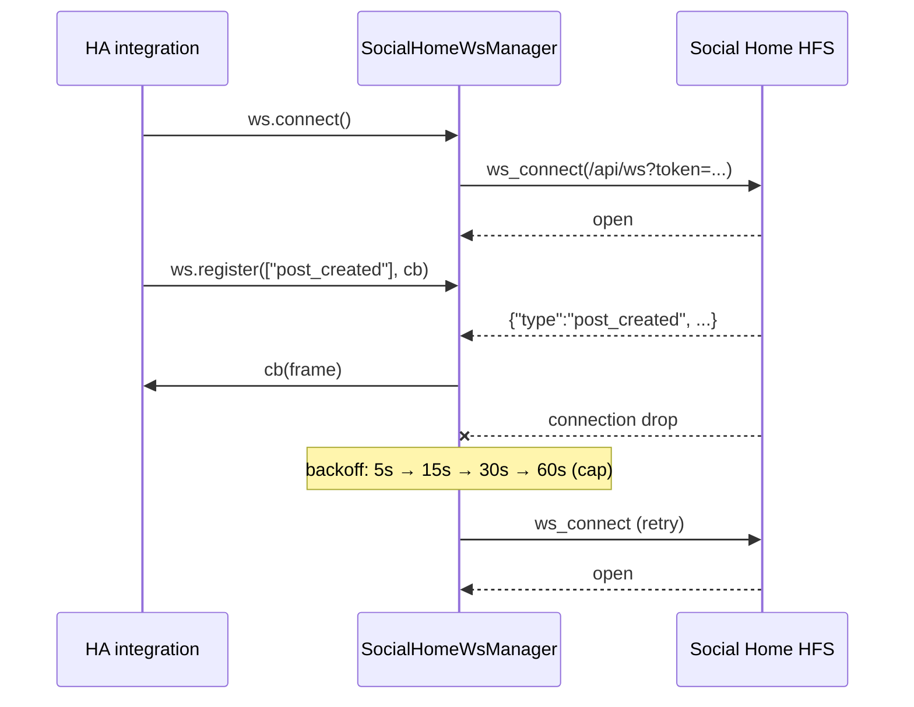

# Architecture

How `socialhome-client` is put together. Distilled from §6 of
`spec_work.md` plus the current code under `socialhome_client/`.

The library has four moving parts: the **HTTP client**
(`SocialHomeClient` + per-feature resources), the **WebSocket
manager** (`SocialHomeWsManager`), the **typed response models**
(`models.py`), and the **exception hierarchy** (`exceptions.py`).
Everything else is glue.

## Module layout

```
socialhome_client/
├── __init__.py        public re-exports — the only names the integration imports
├── client.py          SocialHomeClient + 8 _Resource classes
├── ws_manager.py      SocialHomeWsManager (reconnect, heartbeat, dispatch)
├── models.py          frozen @dataclass response types
└── exceptions.py      SHClientError → SHAuthError | SHNotFoundError
```

`__init__.py` re-exports exactly the names the HA integration uses:
the two top-level classes, every model dataclass, and the three
exceptions. Nothing else is part of the public surface.

## HTTP client

```mermaid
flowchart LR
    caller["HA integration"] -->|c.me.get()| me["_MeResource"]
    caller -->|c.shopping.add()| shop["_ShoppingResource"]
    caller -->|c.bot.create()| bot["_BotResource"]
    me & shop & bot --> client["SocialHomeClient<br/>get / post / patch / put / delete"]
    client --> session["aiohttp.ClientSession"]
    session --> sh["Social Home HFS"]
```

`SocialHomeClient` is a context manager. `__aenter__` lazily creates
an `aiohttp.ClientSession` with the bearer token pre-set as a default
header; `__aexit__` closes the session iff the client created it
(passing `session=...` lets the integration share an existing session
and own its lifecycle).

Resources are private classes that hold a back-reference to the
client and expose feature-shaped methods:

| Resource | Surface | Spec |
|---|---|---|
| `_MeResource` | `get()`, `create_token(...)` | §6.1 |
| `_NotificationsResource` | `unread_count()` | §6.1 / §17.2 |
| `_PresenceResource` | `post_location(username, lat, lon, accuracy_m, zone)` | §6.1 / §7.3 |
| `_SpaceResource` | `list()`, `update(space_id, **fields)` | §6.1 |
| `_ConversationResource` | `list()` | §6.1 |
| `_ShoppingResource` | `list()`, `add()`, `update()`, `delete()`, `clear()` | §6.1 / §7.4 |
| `_CalendarResource` | `list_visible()`, `list_events()`, `create_event()`, `update_event()`, `delete_event()` | §6.1 / §7.5 |
| `_BotResource` | `create()`, `rotate_token()`, `delete()`, `post()`, `post_conversation()` | §6.1 / §7.6 |
| `_FederationResource` | `get_base()`, `set_base()`, `forward_inbox_envelope()` | §6.1 / §7.10 / §11 |

Every resource method calls one of the five HTTP helpers on the
parent client (`get`, `post`, `patch`, `put`, `delete`). The helpers
hide URL composition, JSON serialisation, response parsing, and the
non-2xx → exception mapping. Each helper returns a `dict[str, Any]`
so the resource can deserialise it into a model.

### Federation inbox forwarding is special

`_FederationResource.forward_inbox_envelope()` is the only path that
returns raw bytes + status code instead of a typed model. The HA
integration's `federation_inbox.py` view proxies inbound envelopes
verbatim — including the body bytes, status, and content-type — so
the upstream HFS controls the response shape. Forging JSON parsing
here would corrupt the federation contract.

## WebSocket manager

`SocialHomeWsManager` wraps the WS subscription with reconnect +
dispatch. Constants live at the top of `ws_manager.py`:

```python
_BACKOFF_SCHEDULE_S = (5.0, 15.0, 30.0, 60.0)   # exponential, capped
_HEARTBEAT_S        = 30.0                      # aiohttp ping cadence
_CONNECT_TIMEOUT_S  = 15.0                      # initial open window
```



The manager dispatches frames by `type`. Unknown types are dropped
silently; callback exceptions are logged, not raised, so a single
bad subscriber can't take the manager down. Stop gracefully via
`await ws.close()` — the manager observes a stop event and exits its
reconnect loop on the next iteration.

## Response models

Every `models.py` dataclass is frozen and slotted, with a
`from_api(d: dict)` classmethod that does the conversion from the
JSON shape the HFS returns. Models exist for:

- `User` — `/api/me*`
- `Space`, `Conversation` — listings
- `ShoppingItem`
- `Calendar`, `CalendarEvent`
- `SpaceBot`, `SpaceBotWithToken` (the latter carries the plaintext
  bot token, returned only at create / rotate)
- `FederationBaseUpdate`, `FederationRelayResult`

A new endpoint either fits into an existing model or gets a new one;
the client never returns raw `dict`.

## Exception hierarchy

```
SHClientError              (base; HTTP status attached as .status)
├── SHAuthError            (401 — invalid / expired token)
└── SHNotFoundError        (404 — resource missing)
```

Other non-2xx statuses raise `SHClientError` directly. The HA
integration's coordinator maps these to HA's
`ConfigEntryAuthFailed` / `UpdateFailed` so the UI surfaces the
right state. `SHClientError.status` is the HTTP code; the message
includes the response body when JSON.

## Where things live

| Concern | File |
|---|---|
| Public re-exports | `socialhome_client/__init__.py` |
| Sessions, HTTP helpers, resources | `socialhome_client/client.py` |
| Reconnecting WebSocket | `socialhome_client/ws_manager.py` |
| Frozen response dataclasses | `socialhome_client/models.py` |
| Exception hierarchy | `socialhome_client/exceptions.py` |
| Tests (mirror module tree) | `tests/` |

## Spec references

- §6 — repository overview
- §6.1 — `SocialHomeClient` full method inventory
- §6.2 — `SocialHomeWsManager` reconnect strategy
- §6.3 — response models
- §7.3 — presence bridge (consumer)
- §7.4 — shopping list bridge (consumer)
- §7.5 — calendar bridge (consumer)
- §7.6 — push notification bridge (consumer)
- §7.10 — federation base URL & integration requirements
- §11 — federation inbox proxy
